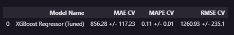
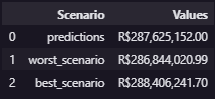

# Previsão de Vendas - Lojas Rossmann

## 🧠 Sobre o Projeto

O objetivo deste projeto é prever as vendas das próximas **6 semanas** para mais de **1.115 lojas Rossmann**, apoiando decisões estratégicas — especialmente a definição do orçamento de reformas das unidades.

A solução completa inclui:

- Pipeline de Machine Learning com **XGBoost**
- Métricas (RMSE, MAE, MAPE)
- API Flask deployada no **Render**
- **Bot do Telegram** para consultar previsões em tempo real
- **Dashboard Power BI** para análise de resíduos
- Pipeline completo de engenharia de dados e feature engineering

  

# 📊 Demonstrações

## ▶️ Vídeo — Bot do Telegram em Ação
> *O usuário envia o ID da loja e recebe na hora a previsão das próximas 6 semanas.*

🔗 **Assista ao vídeo:**  

  

## 📊 Dashboard — Análise de Resíduos e Performance  
> *Entender onde o modelo erra é tão importante quanto prever — aqui analisamos padrões de erro por loja, dia da semana, promoções e sazonalidade.*

🔗 **Acessar Dashboard Power BI:**  
**\[https://app.powerbi.com/view?r=eyJrIjoiOWNlZDFkZmUtOWNhMC00MjliLTliYWMtY2E4YWFkNDAwMGJhIiwidCI6IjhkOGE1MTdmLWUyZDEtNGFmMy05ZmM3LTc1OThmMWI2ZmQ4MyJ9&pageName=6d061c34c14aa2783606]**

  

# 🧩 Estrutura da Solução

Abaixo está o fluxo completo que leva da coleta de dados até a entrega final no bot do Telegram.

  

# 1. 📥 Coleta e Entendimento dos Dados

O dataset contém informações diárias de vendas, clientes, promoções, nível de sortimento, feriados e concorrência.

Principais variáveis:

| Variável | Descrição |
|---------|-----------|
| `Store` | ID da loja |
| `Sales` | Receita diária (target) |
| `Customers` | Número de clientes |
| `Open` | Loja aberta (0/1) |
| `Promo` | Promoção ativa |
| `StateHoliday` | Tipos de feriados |
| `CompetitionDistance` | Distância para concorrentes |
| `Promo2` | Promoção contínua |
| Datas de promoções | Sazonalidade comercial |

  

# 2. 🧹 Limpeza e Tratamento dos Dados

Principais decisões:

- Remoção de dias com loja fechada (`Open = 0`)
- Remoção de outliers extremos
- Preenchimento de `CompetitionDistance` nulo com 200.000m  
  *(assumindo ausência de concorrentes próximos)*
- Conversão de datas e criação de atributos temporais

  

# 3. 🏗️ Feature Engineering

Criação de variáveis que aumentam o poder preditivo:

- `year`, `month`, `week`, `day`
- `is_weekend`
- `competition_time_months`
- `promo2_time_weeks`
- Defasagens temporais (lag features)
- Interações entre promoções e sazonalidade

  

# 4. 🔍 Análise Exploratória

Investigações para entender comportamento das vendas:

- Impacto das promoções
- Sazonalidade semanal e mensal
- Efeito dos feriados
- Impacto da concorrência
- Comparação entre tipos de loja

  

# 5. 🔧 Preparação dos Dados

Inclui:

- Padronização
- Encoding de variáveis categóricas
- Seleção de features com **Boruta**
- Divisão treino/validação respeitando temporalidade
  
  

# 6. 🤖 Modelagem

Após teste com vários algoritmos (Linear Regression, Random Forest, LightGBM), o escolhido foi:

---

## ⭐ **XGBoost Regressor**

Motivos:
- Alta performance em dados tabulares
- Capacidade de capturar interações não lineares
- Estabilidade em valores extremos e sparsidade
- Baixa sensibilidade a colinearidade

---

## 📏 Métricas de Avaliação

| Métrica | Descrição |
|--------|-----------|
| **RMSE** | Erro médio distanciado — principal métrica |
| MAE | Erro médio absoluto |
| MAPE | Percentual médio de erro |

**RMSE Final do Modelo:**  

**Previsões finais:**  

  

# 7. 🚀 Deploy — Flask API no Render

Toda a pipeline preditiva foi empacotada em uma **API Flask**, contendo:

- Pré-processamento
- Carregamento do modelo
- Endpoint `/predict/rossmann`
- Retorno da previsão de 6 semanas

Hospedagem no **Render**, permitindo acesso público.

  

# 8. 🤖 Bot do Telegram — Consulta de Previsões

Uma interface simples para usuários não técnicos.

### 🟦 Como usar o bot:

1. Abra o Telegram  
2. Busque por: **@rossmann25_bot**  
3. Use o comando: `/NumeroLoja`

